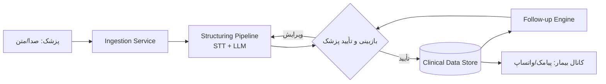

# 🩺 طبیب‌یار (TabibYar)

**دستیار هوشمند مستندسازی و پیگیری درمان برای پزشکان ایرانی**
*Persian Clinical Documentation & Treatment Follow-up Copilot*

---

## چیست؟

پزشک در حین یا بعد از ویزیت، با صدا یا متن خلاصه می‌کند چه گذشت؛ طبیب‌یار آن را به یک پروندهٔ بالینی منظم تبدیل می‌کند: شرح‌حال، یافته‌ها، برنامهٔ درمان، توصیه‌های قابل‌فهم برای بیمار، هشدارها، و موارد پیگیری. در مراجعات بعدی، روند علائم و پاسخ به درمان را کنار هم می‌گذارد تا پزشک سریع‌تر تصمیم بگیرد.

> **مسئلهٔ اصلی:** پزشکان ایرانی در ویزیت‌های شلوغ زمان کافی برای ثبت دقیق شرح‌حال، تصمیم درمانی و پیگیری ندارند؛ در نتیجه اطلاعات شفاهی می‌ماند، پرونده‌ها ناقص می‌شوند، بیمار توصیه‌ها را فراموش می‌کند و پزشک در مراجعهٔ بعدی تصویر کاملی از مسیر درمان ندارد.

### 🔒 مرز محصول (خط قرمز طراحی)

این سیستم **تشخیص نمی‌دهد**، **درمان تجویز نمی‌کند** و بدون تأیید صریح پزشک **هیچ‌چیز را نهایی یا برای بیمار ارسال نمی‌کند**. نقش آن کمک به مستندسازی، یادآوری، پیگیری و خلاصه‌سازی است — نه جایگزینی قضاوت بالینی. جزئیات کامل در [security-privacy](docs/wiki/security-privacy.md).

## نمای کلی معماری

نمای کامل‌تر در [docs/architecture.md](docs/architecture.md).

## چرا این نام؟

| نام | زاویه | وضعیت |
|---|---|---|
| **طبیب‌یار (TabibYar)** | همراه پزشک؛ واضح، حرفه‌ای، قابل برندسازی، مناسب B2B/کلینیک | ✅ انتخاب‌شده |
| پیگیر (Peygir) | تمرکز روی «پیگیری درمان»، مزیت رقابتی اصلی محصول | جایگزین قوی |
| نبضا (Nabza) | از «نبض»؛ کوتاه، به‌یادماندنی | جایگزین |

## 📚 نقشهٔ مستندات

| بخش | سند |
|---|---|
| معماری سیستم | [docs/architecture.md](docs/architecture.md) |
| دامنهٔ فاز اول (MVP) | [docs/phase1-mvp.md](docs/phase1-mvp.md) |
| نقشهٔ راه | [docs/roadmap.md](docs/roadmap.md) |
| بک‌لاگ ایشوها | [docs/issues.md](docs/issues.md) و [GitHub Issues](https://github.com/massoudsh/TabibYar/issues) |
| پرامپت ساخت‌دهی بالینی | [docs/prompts/structuring-prompt.md](docs/prompts/structuring-prompt.md) |
| اسکیمای دیتابیس (DDL) | [docs/db/schema.sql](docs/db/schema.sql) |
| ویکی (واژه‌نامه، پرسونا، مدل داده، امنیت، API) | [docs/wiki/](docs/wiki/) و [GitHub Wiki](https://github.com/massoudsh/TabibYar/wiki) |
| پیاده‌سازی MVP (Node.js/Express) | [app/](app/) — نگاشت کامل ایشو→کد در [app/README.md](app/README.md) |
| اسناد تحقیقاتی (STT/پیامک/حقوقی/پایلوت) | [docs/research/](docs/research/) |
| سرویس STT فارسی خودمیزبان | [stt-service/](stt-service/) — مدل [`whisper-persian`](https://huggingface.co/Paulwalker4884/whisper-persian) |

## وضعیت فعلی

پیاده‌سازی اولیهٔ MVP انجام شد — سرور Express با پایپ‌لاین ساخت‌دهی، کلاینت وب پزشک
(ورود/ثبت ویزیت/بازبینی/تأیید)، رمزنگاری در حالت ذخیره، Audit Log، RBAC پایه، صف
پردازش ناهمزمان و ارسال پیامک بعد از تأیید. علاوه‌بر آن، یک **دستیار RAG** مبتنی بر
پایگاه دانش داخلی (`app/src/knowledge/`) بعد از هر ساخت‌دهی نکات یادآوری/مستندسازی
پیشنهاد می‌دهد و به پزشک اجازهٔ پرسش تعاملی می‌دهد — همیشه با استناد به منبع و بدون
تشخیص/تجویز. کلاینت وب با ناوبری مشترک و طراحی بصری یکپارچه به‌روزرسانی شده است.
جزئیات کامل و نحوهٔ اجرا در [app/README.md](app/README.md).
برای گفتار-به-متن فارسی (ایشو #2)، سرویس خودمیزبان [stt-service/](stt-service/) با مدل
متن‌باز [`Paulwalker4884/whisper-persian`](https://huggingface.co/Paulwalker4884/whisper-persian)
(فاین‌تیون LoRA فارسی روی Whisper-base، Apache-2.0) پیاده‌سازی و از طریق contract موجود
(`STT_PROVIDER=http`) به اپ متصل شده — تست عملی دقت روی صدای واقعی پزشکان همچنان باز است.
سایر موارد نیازمند تصمیم/اقدام انسانی (انتخاب نهایی سرویس پیامک، بررسی حقوقی، انتخاب
پزشکان پایلوت) در [docs/research/](docs/research/) مستند شده‌اند.

## مزیت رقابتی

فهم زبان فارسی پزشکی، گفتار نیمه‌رسمی پزشک/بیمار، ساختار پرونده‌نویسی رایج مطب‌های ایران، نیاز به خلاصه‌سازی قابل‌فهم برای بیمار، و طراحی ایمن (human-in-the-loop) برای محیط درمان.
